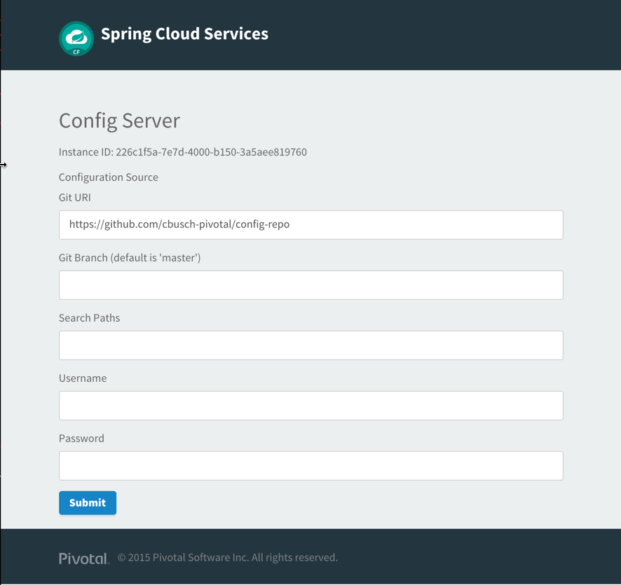
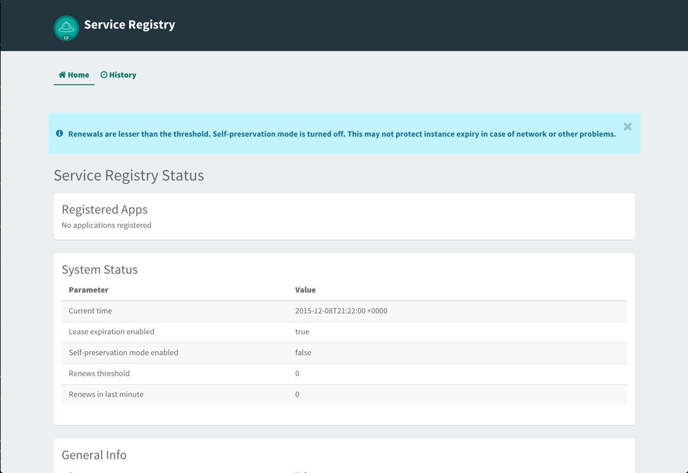
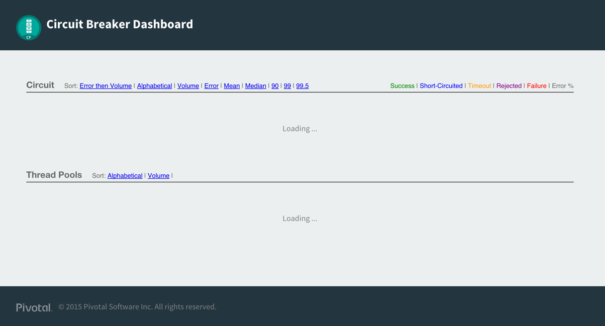

:compat-mode:
= Lab 8 - Binding to Spring Cloud Services

[abstract]
--

--

== Using Pivotal's PCF3 cloud foundry instance
. If you were using http://run,pivotal.io (Pivotal Web Services (PWS) public cloud) in prior labs, then you will need to switch to a PCF instance with the Spring Cloud Services (Config Server, Service Registry, and Circuit Breaker) installed. 

. PCF3 does have these service available for use in this workshop. Labs 8 - 11 require Spring Cloud Services. In the PCF3 environment, several studentX accounts are available for use. Please see the instructor for your student number assignment before continuing.

. From a command prompt, set the API target for the CLI:
+
----
$ cf api --skip-ssl-validation https://api.pcf3.cloud.fe.pivotal.io
----

. Login to Pivotal Cloud Foundry (use information from your instructor to log on to Pivotal Cloud Foundry):
+
----
$ cf login -u student<assigned number> -p password
----
+
Follow the prompts, choosing default organization and space.

== Creating Service Instances
> Each of these services takes a few minutes to initialize while creating application instances and other resources to support them. With many students performing the same actions on PCF3 at the same time, please be patient while initialization completes.

. The Fortune service stores the fortunes in a database. 
From the CLI, let's _create_ a free MySQL service instance:
+
----

$cf create-service p-mysql 100mb-dev fortune-db
Creating service instance fortune-db in org whewatt_org / space testing as whewatt@pivotal.io...
OK

----

. Next we'll create an instance of the config service.
+
----
$cf create-service p-config-server standard config-server
Creating service instance config-server in org whewatt_org / space testing as whewatt@pivotal.io...
OK
----

. Now, we need an instance of the service registry service.
+
----
$cf create-service p-service-registry standard service-registry
Creating service instance service-registry in org whewatt_org / space testing as whewatt@pivotal.io...
OK
----

. The final service that we need is for the circuit breaker dashboard.
+
----
$cf create-service p-circuit-breaker-dashboard standard circuit-breaker
Creating service instance circuit-breaker in org whewatt_org / space testing as whewatt@pivotal.io...
OK
----
+
. We need to initialize each of the Spring Cloud Services.  Open the Application Manager console and scroll down until you see the Spring Cloud services.  Under the "config-server", click "Manage".
+
image::../../Common/images/SpringCloudServices.png[]
+
. You should see a blank page for the Config Server.
+
image::../../Common/images/ConfigServerUp.png[]
+
. Later you will set up your own configuration repository in Github.  For now, enter "https://github.com/cbusch-pivotal/config-repo".
+

+
. Go back to the Application Manager console and click "Manage" under "service-registry".  When the service has initialized you should a screen similar to the following:
+

+
. Go back to the Application Manager console and click "Manage" under "circuit-breaker".  When the service has initialized you should a screen similar to the following:
+

== Push the applications

. Change to the directory that contains fortune-ui and fortune-teller-fortune-service.
+
----
$ cd $COURSE_HOME/session_05/lab_08/fortune-teller
----

. Open the manifest.yml file.  Notice the application names and the service bindings.
+
----
---
instances: 1
memory: 512M
applications:
- name: fortune-service
  host: fortunes-${random-word}
  path: fortune-teller-fortune-service/target/fortune-teller-fortune-service-0.0.1-SNAPSHOT.jar
  services:
  - fortune-db
  - config-server
  - service-registry
  env:
      SPRING_PROFILES_ACTIVE: pcf
- name: fortune-ui
  host: fortunes-ui-${random-word}
  path: fortune-teller-ui/target/fortune-teller-ui-0.0.1-SNAPSHOT.jar
  services:
  - config-server
  - service-registry
  - circuit-breaker
----

.  Push the applications
+
----
$cf push
Using manifest file /Users/cbusch/git/SpringCloudWorkshop/session_05/lab_08/fortune-teller/manifest.yml

Creating app fortune-service in org instructor-org / space development as instructor...
OK

Creating route fortunes-odorful-tantalum.pcf3.cloud.fe.pivotal.io...
OK

Binding fortunes-odorful-tantalum.pcf3.cloud.fe.pivotal.io to fortune-service...
OK

Uploading fortune-service...
Uploading app files from: /Users/cbusch/git/SpringCloudWorkshop/session_05/lab_08/fortune-teller/fortune-teller-fortune-service/target/fortune-teller-fortune-service-0.0.1-SNAPSHOT.jar
Uploading 1.2M, 130 files
Done uploading
OK
Binding service fortune-db to app fortune-service in org instructor-org / space development as instructor...
OK
Binding service config-server to app fortune-service in org instructor-org / space development as instructor...
OK
Binding service service-registry to app fortune-service in org instructor-org / space development as instructor...
OK

Starting app fortune-service in org instructor-org / space development as instructor...
Creating container
Successfully created container
Downloading app package...
Downloaded app package (35.5M)
No buildpack specified; fetching standard buildpacks to detect and build your application.
Downloading buildpacks (staticfile_buildpack, java_buildpack_offline, ruby_buildpack, nodejs_buildpack, go_buildpack, python_buildpack, php_buildpack, binary_buildpack)...
...
Downloaded buildpacks
Staging...
-----> Java Buildpack Version: v3.3.1 (offline) | https://github.com/cloudfoundry/java-buildpack.git#063836b
-----> Downloading Open Jdk JRE 1.8.0_65 from https://download.run.pivotal.io/openjdk/trusty/x86_64/openjdk-1.8.0_65.tar.gz (found in cache)
       Expanding Open Jdk JRE to .java-buildpack/open_jdk_jre (1.4s)
-----> Downloading Open JDK Like Memory Calculator 2.0.0_RELEASE from https://download.run.pivotal.io/memory-calculator/trusty/x86_64/memory-calculator-2.0.0_RELEASE.tar.gz (found in cache)
       Memory Settings: -Xms382293K -XX:MetaspaceSize=64M -Xmx382293K -XX:MaxMetaspaceSize=64M -Xss995K
-----> Downloading Spring Auto Reconfiguration 1.10.0_RELEASE from https://download.run.pivotal.io/auto-reconfiguration/auto-reconfiguration-1.10.0_RELEASE.jar (found in cache)
Exit status 0
Staging complete
Uploading droplet, build artifacts cache...
Uploading droplet...
Uploading build artifacts cache...
Uploaded build artifacts cache (107B)
Uploaded droplet (80.2M)
Uploading complete

0 of 1 instances running, 1 starting
1 of 1 instances running

App started

OK

App fortune-service was started using this command `CALCULATED_MEMORY=$($PWD/.java-buildpack/open_jdk_jre/bin/java-buildpack-memory-calculator-2.0.0_RELEASE -memorySizes=metaspace:64m.. -memoryWeights=heap:75,metaspace:10,native:10,stack:5 -memoryInitials=heap:100%,metaspace:100% -totMemory=$MEMORY_LIMIT) && SERVER_PORT=$PORT $PWD/.java-buildpack/open_jdk_jre/bin/java -cp $PWD/.:$PWD/.java-buildpack/spring_auto_reconfiguration/spring_auto_reconfiguration-1.10.0_RELEASE.jar -Djava.io.tmpdir=$TMPDIR -XX:OnOutOfMemoryError=$PWD/.java-buildpack/open_jdk_jre/bin/killjava.sh $CALCULATED_MEMORY org.springframework.boot.loader.JarLauncher`

Showing health and status for app fortune-service in org instructor-org / space development as instructor...
OK

requested state: started
instances: 1/1
usage: 512M x 1 instances
urls: fortunes-odorful-tantalum.pcf3.cloud.fe.pivotal.io
last uploaded: Wed Dec 9 02:34:24 UTC 2015
stack: cflinuxfs2
buildpack: java-buildpack=v3.3.1-offline-https://github.com/cloudfoundry/java-buildpack.git#063836b java-main open-jdk-like-jre=1.8.0_65 open-jdk-like-memory-calculator=2.0.0_RELEASE spring-auto-reconfiguration=1.10.0_RELEASE

     state     since                    cpu    memory      disk      details
#0   running   2015-12-08 08:35:44 PM   0.0%   0 of 512M   0 of 1G
Creating app fortune-ui in org instructor-org / space development as instructor...
OK

Creating route fortunes-ui-literal-adverbial.pcf3.cloud.fe.pivotal.io...
OK

Binding fortunes-ui-literal-adverbial.pcf3.cloud.fe.pivotal.io to fortune-ui...
OK

Uploading fortune-ui...
Uploading app files from: /Users/cbusch/git/SpringCloudWorkshop/session_05/lab_08/fortune-teller/fortune-teller-ui/target/fortune-teller-ui-0.0.1-SNAPSHOT.jar
Uploading 1.1M, 133 files
Done uploading
OK
Binding service config-server to app fortune-ui in org instructor-org / space development as instructor...
OK
Binding service service-registry to app fortune-ui in org instructor-org / space development as instructor...
OK
Binding service circuit-breaker to app fortune-ui in org instructor-org / space development as instructor...
OK

Starting app fortune-ui in org instructor-org / space development as instructor...
Creating container
Successfully created container
Downloading app package...
Downloaded app package (35M)
No buildpack specified; fetching standard buildpacks to detect and build your application.
Downloading buildpacks (staticfile_buildpack, java_buildpack_offline, ruby_buildpack, nodejs_buildpack, go_buildpack, python_buildpack, php_buildpack, binary_buildpack)...
...
Downloaded buildpacks
Staging...
-----> Java Buildpack Version: v3.3.1 (offline) | https://github.com/cloudfoundry/java-buildpack.git#063836b
-----> Downloading Open Jdk JRE 1.8.0_65 from https://download.run.pivotal.io/openjdk/trusty/x86_64/openjdk-1.8.0_65.tar.gz (found in cache)
       Expanding Open Jdk JRE to .java-buildpack/open_jdk_jre (1.4s)
-----> Downloading Open JDK Like Memory Calculator 2.0.0_RELEASE from https://download.run.pivotal.io/memory-calculator/trusty/x86_64/memory-calculator-2.0.0_RELEASE.tar.gz (found in cache)
       Memory Settings: -XX:MaxMetaspaceSize=64M -Xss995K -Xms382293K -XX:MetaspaceSize=64M -Xmx382293K
-----> Downloading Spring Auto Reconfiguration 1.10.0_RELEASE from https://download.run.pivotal.io/auto-reconfiguration/auto-reconfiguration-1.10.0_RELEASE.jar (found in cache)
Exit status 0
Staging complete
Uploading droplet, build artifacts cache...
Uploading droplet...
Uploading build artifacts cache...
Uploaded build artifacts cache (108B)
Uploaded droplet (79.8M)
Uploading complete

0 of 1 instances running, 1 starting
0 of 1 instances running, 1 starting
1 of 1 instances running

App started

OK

App fortune-ui was started using this command `CALCULATED_MEMORY=$($PWD/.java-buildpack/open_jdk_jre/bin/java-buildpack-memory-calculator-2.0.0_RELEASE -memorySizes=metaspace:64m.. -memoryWeights=heap:75,metaspace:10,native:10,stack:5 -memoryInitials=heap:100%,metaspace:100% -totMemory=$MEMORY_LIMIT) && SERVER_PORT=$PORT $PWD/.java-buildpack/open_jdk_jre/bin/java -cp $PWD/.:$PWD/.java-buildpack/spring_auto_reconfiguration/spring_auto_reconfiguration-1.10.0_RELEASE.jar -Djava.io.tmpdir=$TMPDIR -XX:OnOutOfMemoryError=$PWD/.java-buildpack/open_jdk_jre/bin/killjava.sh $CALCULATED_MEMORY org.springframework.boot.loader.JarLauncher`

Showing health and status for app fortune-ui in org instructor-org / space development as instructor...
OK

requested state: started
instances: 1/1
usage: 512M x 1 instances
urls: fortunes-ui-literal-adverbial.pcf3.cloud.fe.pivotal.io
last uploaded: Wed Dec 9 02:35:57 UTC 2015
stack: cflinuxfs2
buildpack: java-buildpack=v3.3.1-offline-https://github.com/cloudfoundry/java-buildpack.git#063836b java-main open-jdk-like-jre=1.8.0_65 open-jdk-like-memory-calculator=2.0.0_RELEASE spring-auto-reconfiguration=1.10.0_RELEASE

     state     since                    cpu    memory           disk           details
#0   running   2015-12-08 08:37:22 PM   0.0%   281.2M of 512M   188.9M of 1G
----

. Verify that the applications are running by visiting the routes that were generated by the CLI.

image::/../../Common/images/YourFutureIsUnclear.png[]

link:/README.md#course-materials[Course Materials home] | link:/session_05/lab_09/lab_09.adoc[Lab 9 - Service Registry]
